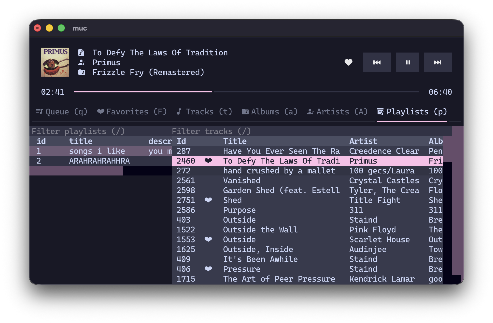

<h1 align="center">μ - your personal music library</h1>

  μ (<code>mu</code>) is an opinionated MacOS and Linux music library management tool designed to be <b>backup friendly</b> and <b>programmable</b>. 
  All music is stored in a hierarchical format, and the internal database is a simple SQLite file.

  µ comes with mµc (<code>muc</code>) which is a tui music player that utilizes VLC for audio playback.

  To get started with µ, checkout the <a href="./DOCS.md">documentation</a>.

