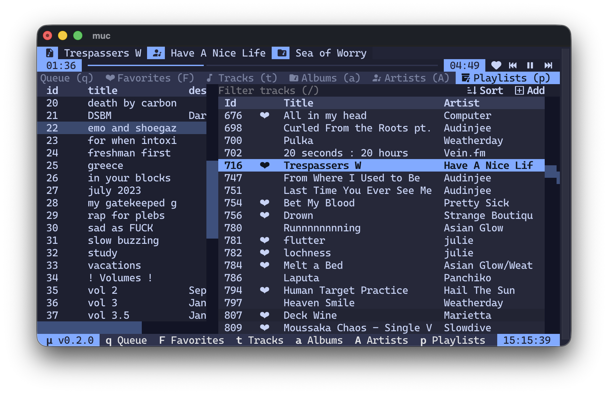

<h1 align="center">µ - your personal music library</h1>
<div align="center">
<br><br>
<p>
  μ (<code>mu</code>) is an opinionated, cross platform, mp3 only, music library management tool designed to be <b>backup friendly</b> and <b>programmable</b>. All music is stored in a hierarchical format, and the internal database is a simple SQLite file.</p>



<p>
  µ comes with mµc (<code>muc</code>), a tui music player built for µ that focuses on speed and simplicity.
</p>
</div>

## Table of Contents

<!-- TOC -->

- [Table of Contents](#table-of-contents)
- [What is µ?](#what-is-%C2%B5)
- [What is mµc?](#what-is-m%C2%B5c)
- [Installation](#installation)
  - [File Structure](#file-structure)
- [What's included](#whats-included)
- [µ Basic Commands](#%C2%B5-basic-commands)
  - [Importing from iTunes](#importing-from-itunes)
  - [Importing mp3 files](#importing-mp3-files)
  - [µ query syntax](#%C2%B5-query-syntax)
    - [Available columns for tracks](#available-columns-for-tracks)
  - [Removing and favoriting tracks](#removing-and-favoriting-tracks)
  - [Listing and searching](#listing-and-searching)
  - [Playlists](#playlists)
- [mµc Basic Usage](#m%C2%B5c-basic-usage)
  - [Tab Navigation](#tab-navigation)
  - [Pane Navigation](#pane-navigation)
  - [Table Navigation](#table-navigation)
  - [Tracks Table Navigation](#tracks-table-navigation)
  - [Playback/Media Keys](#playbackmedia-keys)
  - [Playlist/Queue Table Navigation](#playlistqueue-table-navigation)
- [Using the µ Python API](#using-the-%C2%B5-python-api)
  - [Reading your library](#reading-your-library)
  - [Creating and managing playlists](#creating-and-managing-playlists)
  - [Sorting](#sorting)
  - [Searching](#searching)
  - [Importing and Scanning](#importing-and-scanning)
  - [Favorites and play counts](#favorites-and-play-counts)
  - [There's more!](#theres-more)

<!-- /TOC -->

## What is µ?

µ at its core is just a python library used to interface with a simple SQLite database file. It keeps track of what music you have in your library, where it is located, what playlists you have, etc. It was built from the ground up to allow other applications to interface with it. Even you, the reader, can programmatically search, import, and categorize music with µ. This is achieved through an easy to use python API and search query syntax.

 **µ is not a player.** The only functionality µ takes responsibility over is the management of your library and how you interface with it. This standardization will hopefully allow for other players to be created and given support. You can use µ entirely from the CLI by using the `mu` command. This includes functionality such as searching, importing, favoriting, and playlists.

## What is mµc?

mµc is a terminal music player. It will probably be where you spend most of your time using µ, and is currently the only supported client for µ. It is included by default when installing µ, and can be started with the `muc` command.

## Installation

µ is supported on MacOS, Linux, and Windows.

mµc is only supported on Macos and Linux. While mµc might work on windows, bugs are expected.

It is highly advised to use a terminal such as [kitty](https://github.com/kovidgoyal/kitty), [ghostty](https://github.com/ghostty-org/ghostty), [weztern](https://github.com/wezterm/wezterm), or [konsole](https://github.com/kde/konsole) if you plan on using mµc. These terminals work better with the [Textual](https://github.com/textualize/textual) framework mµc is based upon.

Before proceeding, ensure you have Python >=v3.12.13.

To install mu, use pip and point to this repo.

```bash
pip install git+https://github.com/brodyking/mu.git
```

To update mu, reinstall with the `upgrade` and `force-reinstall` flags.

```bash
pip install --upgrade --force-reinstall git+https://github.com/brodyking/mu.git
```

### File Structure

Upon running `mu` for the first time, or utilizing a library that interacts with µ, `~/Music/mu/` will be created.

```
.
├── albumart/ 
├── mu.db #
└── source/
```

- `albumart/` contains all albumart for all tracks. It does not contain duplicates, and it's location is stored in the database alongside each track.
- `source/` contains all the original mp3 files.
- `mu.db` contains the SQLite database that stores track metadata, playlist data, etc.

The `~/Music/mu/` folder can be backed up and then restored to preserve your music library. Note that when the library is moved to a new location, track locations will need to be adjusted in the database.

## What's included

The two basic CLI commands that µ come with are `mu` and `muc` .

- `mu` allows you to interact with µ through the CLI. Almost all operations that are supported by the api are supported through the CLI.
- `muc` starts the tui client for µ. It is currently the only way to interact with µ. Support for mobile/web is planned.

## µ Basic Commands

Upon running `mu` for the first time, an output similar to this will be shown.

```
Usage: mu [OPTIONS] COMMAND [ARGS]...

  your personal music library

Options:
  --install-completion  Install completion for the current shell.
  --show-completion     Show completion for the current shell, to copy it or
                        customize the installation.
  --help                Show this message and exit.

Commands:
  scan      refresh metadata (alias: s)
  version   get version (alias: v)
  itunes    import an itunes library xml (alias: it)
  list      list different parts of your library (alias: ls)
  playlist  modify playlists (alias: p)
  track     modify tracks (alias: t)

  created and maintained by brody king at https://github.com/brodyking/mu
```

Most of these commands are self-explanatory.

- **Scan** goes through all tracks in `~/Music/mu/source/`, and updates their metadata.
- **Version** prints the current µ version.

### Importing from iTunes

To import an existing library from iTunes, use the `itunes` command, or its alias `it` to an XML export of your iTunes library.

This can be done by going to **File > Library > Export Library**

```bash
mu itunes ~/Desktop/Library.xml
```

### Importing mp3 files

To import new mp3 files to your library, use the `track` subparser (aliased
 as `t` ), with the `import` command (aliased as `i` )

```bash
 # Full command
 mu track import ~/Desktop/Time.mp3

 # Same command, easier to type.
 mu t i ~/Desktop/Time.mp3
 ```

 This command can be used to import folders of music, or just individual mp3 files. All tracks imported are copied into the `~/Music/mu/source/` folder.

### µ query syntax

The same `track` subparser mentioned above has other commands. Those being `remove` (alias `rm` ) and `favorite` (alias `f` ). But to use these commands, you must understand µ query syntax.

When selecting albums, tracks, playlists, etc, you have to query for them. This is done by matching a column with a value. It's easiest to just show a few examples.

If I want to find all the tracks by *Pink Floyd* , I can query by matching the artist column.

```python
"artist=Pink Floyd"
```

The `=` operand looks for an exact match. If this is undesired, use the `:` operand.

```python
"artist:Pink"
```

The query above would return tracks by *Pink Floyd*, alongside all other tracks with the artist containing *Pink*

And operations are done with the `&` operand.

```python
"artist=Pink Floyd&album=The Dark Side Of The Moon"
```

The query above would return only tracks by *Pink Floyd* in *The Dark Side Of The Moon* .

Or operations are done with the `,` operand.

```python
"artist=Pink Floyd,artist=David Gilmour"
```

The above query would return all tracks by *Pink Floyd* and all tracks by *David Gilmour* .

**Note: `,`, `=`, and `&` are reserved characters that are used when parsing. To get an exact match, wrap the value around quotation marks. Apostrophes will not work.**

```python
# This will cause an error
'title=Sexy & Candy'
# This will run successfully
'title="Sex & Candy"'
```

#### Available columns for tracks

Searching for tracks, albums, and artists support these prefixes.

| Column |
| ------ |
| `id` |
| `favorite` |
| `title`|
| `artist`|
| `album`|
| `plays` |
| `time`|
| `dateadded`|
| `tracknumber`|
| `albumartist`|
| `discnumber`|
| `genre`|
| `date`|
| `filepath`|
| `filename`|
| `albumart`|

Searching for playlists supports these prefixes.

| Column |
| ------ |
| `id` |
| `title` |
| `description` |

### Removing and favoriting tracks

To toggle the favorite status of a track, use the `track` subparser with the `favorite` (alias `f`) command and µ Query Syntax to select the song.

```bash
mu track favorite "id=1"
```

This favorites the track with the id == 1.

 **Note: All tracks and playlists are given their own ID. Artists and Albums are not given IDs.**

To remove a track, use the same subparser with the `remove` command (alias `rm` )

```bash
mu track remove "id=1"
```

It may be important to note that removing a track doesn't delete it, it just gets removed from the database. Running a `scan` command will bring it back into the library, so make sure to delete its source file as well.

### Listing and searching

The `list` (alias `ls` ) subparser is used to list tracks, albums, artists, playlists, and playlists contents, alongside searching through them.

```bash
mu list tracks <query>
mu list albums <query>
mu list artists <query>
mu list playlists <query>
mu list playlist <query>
```

You can include a search query after these commands to filter through them. This is the most efficient way to search, as it is done at the SQL level.

```bash
mu list albums "artist:Pink Floyd"
```

The above query returns all albums by Pink Floyd.

 **Note: Tracks, Albums, and Artists all query the `tracks` table. This means you can use all the same columns across different types.**

### Playlists

The `playlist` (alias `p` ) subparser is used to create, modify, and delete playlists.

You can create a playlist with the `create` (alias `c` ) command.

```bash
mu playlist create "Workout"
```

The above command will return a newly created, empty playlist. Each playlist has its own unique ID.

Most playlist commands are self-explanatory.

```
Commands:
  append  append track(s) into playlist(s) (alias: a)
  create  create a new playlist (alias: c)
  delete  delete a playlist (alias: d)
  insert  insert track(s) into playlist(s) at a specified position...
  remove  remove track(s) from playlist(s) (alias: rm)
```

## mµc Basic Usage

To get started using mµc, simply run `muc` in the terminal of your choosing.

For a list of available keybinds, press `?`. (Note: This does not work inside of popups)

### Tab Navigation

You can to a specific tab with the following keybindings.

| Key | Tab |
| --- | --- |
| `Q` | Queue |
| `F` | Favorites |
| `T` | Tracks |
| `A` | Albums |
| `R` | Artists |
| `P` | Playlists |
| `O` | Options |

You can navigate to surrounding tabs with the following keybindings.

| Key | Action |
| --- | ------ |
| `H` | Previous Tab |
| `L` | Next Tab |

### Pane Navigation

In tabs such as `Playlists` or `Options` , you will be given multiple tables. You can change focus by using the following keybindings.

| Key | Action |
| --- | ------ |
| `ctrl+h` | Left Pane |
| `ctrl+l` | Right Pane |

### Table Navigation

For all tables, the following keybindings are supported.

| Key | Action |
| --- | ------ |
| `j` | Down |
| `k` | Up |
| `y` | Yank line |
| `Tab` | Inspect row |

If the table supports search, you can press `/` to focus the search field.

 **Note: Every table that supports searching supports µ query syntax.**

### Tracks Table Navigation

The tracks table, used in `Favorites` , `Tracks` and `Playlists` allows for additional keybindings.

| Key | Action |
| --- | ------ |
| `,` | Open the Sort popup. |
| `.` | Open the Add-to popup. |
| `f` | Favorite/unfavorite a track |

### Playback/Media Keys

Playback keys are accessible almost everywhere inside of µ, barring input fields.

| Key | Action |
| --- | ------ |
| `h` | Previous track |
| `l` | Next track |
| `+` | Increase Volume |
| `_` | Decrease Volume |

### Playlist/Queue Table Navigation

In both the `Playlist` and `Queue` , you can remove tracks with the `d` key.

## Using the µ Python API

The `mu` command explained earlier in this README is essentially just a wrapper around the mu `Api` object.
If you wish to sort, organize, build a client, etc, then the µ Api will have everything you need to get started.

### Reading your library

Every getter returns a dict, so you can index straight into it directly.

```python
from mu.api import Api
from mu.models import Track, Album, Artist, Playlist

# µ API Object
a = Api()

# Returns a dict with tracks mapped to their IDs.
tracks: dict[int,Track] = a.get_tracks()
# Returns a dict with albums mapped to a tuple of the albums artist and title of album
albums: dict[tuple[str,str],Album] = a.get_albums()
# Returns a dict with artists mapped to their name
artists: dict[str,Artist] = a.get_artists()
# Returns a dict with playlists mapped to their IDs.
playlists: dict[int, Playlist] = a.get_playlists()
```

### Creating and managing playlists

You can accomplish all playlist actions, such as creation, modification, and deletion, from within the API.

In this example, we create a new playlist, add all tracks by *Kanye West* into it, and then print out all the tracks in the playlist.

```python
from mu.api import Api
from mu.models import Track, Playlist

a = Api()

# Creates the playlist
pl: Playlist = a.create_playlist("Workout",description="Songs to listen to in the gym")
# Appends the playlist
pl: Playlist = a.append_playlists(f"id={pl.id}",f"artist=Kanye West")[pl.id]

for t in pl.tracks:
  print(t.title)
```

### Sorting

Sorting and filtering are done through SQL, so prefer them over sorting in python.

In this example, we are finding the top 10 most played songs in the library.

```python
from mu.api import Api

a = Api()

# Fetches tracks using order_by and descending
top = a.get_tracks(order_by="plays", descending=True)

for t in list(top.values())[:10]:
  print(f"{t.title} - {t.plays}")
```

### Searching

Every method takes in a `*_term` argument that uses µ Query Syntax.

```python
from mu.api import Api

a = Api()

pink_floyd = a.get_tracks("artist=Pink Floyd")
anything_pink = a.get_tracks("artist:Pink")
dsotm = a.get_tracks("artist=Pink Floyd&album=The Dark Side Of The Moon")
either = a.get_tracks("artist=Pink Floyd+artist=David Gilmour")

# terms filter the underlying tracks, so they work on albums and artists too
floyd_albums = a.get_albums("artist:Pink Floyd")
```

Incorrectly formatted queries raise a `ValueError`, so validate anything user-supplied if possible.

```python
user_input = input("")

try:
  results = api.get_tracks(user_input)
except ValueError as e:
  print(f"Bad query: {e}")
```

The four failure modes are as followed:

| Query | Error |
| ----- | ----- |
| `"artist"` | Filter is missing a prefix (needs `:` or `=`) |
| `"artist="` | Filter has no value. |
| `"bogus=x"` | Unknown of empty search field. |
| `"title=Track: One"` | Unknown of empty search field. |

Pay attention to the last one, as the parser splits on the `:` before `=`, so a value containing a colon is misread as a column name. To escape it, use double quotes around the value.

### Importing and Scanning

`import_media()` copies files into `source/` and adds them to the database.

`scan_source_folder()` re-reads whats already in `source/` and updates metadata.

Both are generators that yield one progress dict per file, and neither does anything until iterated over. Writes are batched, so records arrive in groups.

```python
from mu.api import Api

a = Api()

for result in a.import_media("~/Desktop/new-album"):
    if result["ok"]:
        print(f"[{result['count']}/{result['total']}] {result['filename']}")
    else:
        print(f"failed: {result['filename']} — {result['error']}")
```

### Favorites and play counts

These are incredibly easy one liners.

```python
from mu.api import Api

a = Api()

a.favorite_track("id=1") # toggles favorite status
a.increment_playcount_tracks("id=1",1) # increases playcount by 1
```

These return the new versions of the items updated, so you can verify changes or update UI elements accordingly.

### There's more

This has barely scratched the surface on what µ can do. The best way to learn about its functionality is to look at the [API's source code itself](./src/mu/api.py). It's only about 600 lines and is self documenting.
