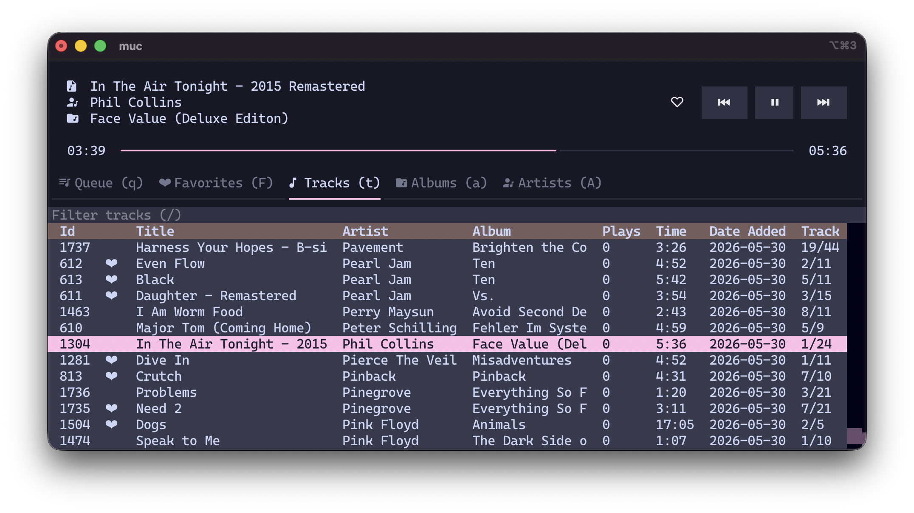

<h1 align="center">μ - your personal music library</h1>

<p align="center">
  μ (<code>mu</code>) is a MacOS and Linux music library management tool designed to be <b>backup friendly</b> and <b>programmable</b>.<br>
  All music is stored in a hierarchical format, and the internal database is a simple SQLite file.</p>



<p align="center">µ comes with mµc (<code>muc</code>) which is a tui music player that utilizes VLC for audio playback.</p>

## Install

- [μ - your personal music library](#μ---your-personal-music-library)
  - [Install](#install)
    - [Step 1: Download Python and VLC](#step-1:-download-python-and-vlc)
    - [Step 2: Download the source code](#step-2:-download-the-source-code)
    - [Step 3: Install as python package](#step-3:-install-as-python-package)
  - [Usage](#usage)

### Step 1: Download Python and VLC

Please ensure you have **Python 3.12.13** or newer, alongside
pip. You must also have VLC downloaded for mµc.

### Step 2: Download the source code

First, clone the repo

```
git clone https://github.com/brodyking/mu.git
```

### Step 3: Install as python package

Navigate to the repo, then install it as a python package

```
pip install .
```

## Usage

Upon running `mu` for the first time, mu will create a folder in your music
directory (`~/Music/mu/`).

- `~/Music/mu/source/` stores your music files.
- `~/Music/mu/albumart/` stores album art files.
- `~/Music/mu/mu.db` is the central database file.

The standard way to operate mu is through the terminal. To learn more about the
commands and use of each command, run `-h` after each command.

To use the player, run `muc`.
